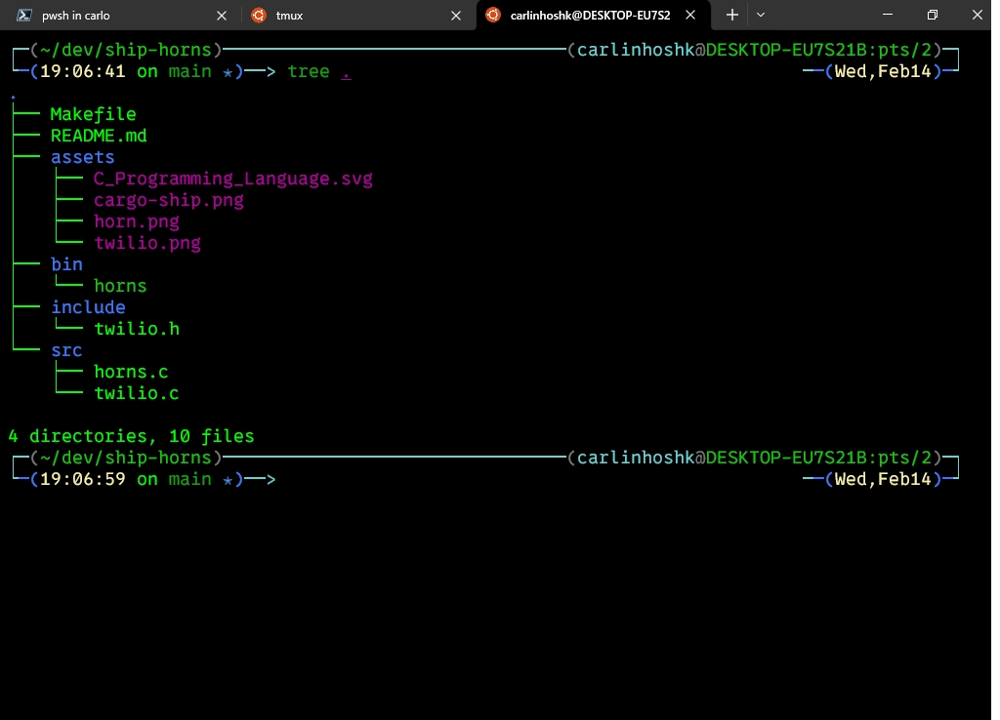

<div style="display: flex;">
    
    
    
    
</div>


Ship-Horns Verificador de Status de Contêiner Docker que avisa por Twilio SMS
========================================================




Este é um programa simples em C que verifica o status de um contêiner Docker especificado e envia uma mensagem SMS via Twilio se o contêiner não estiver em execução. O programa verifica o status do contêiner em intervalos regulares e pode ser útil para monitorar a disponibilidade e o status de contêineres Docker em execução.

Requisitos
----------

*   Compilador C (como GCC)

*   Contêiner Docker a ser monitorado

Como Usar
---------
Claro, aqui está o texto formatado corretamente para Markdown:

1. Clone o repositório.

2. Compile o programa com make. Por exemplo:

    ```bash
    make
    ```

3. Execute o programa, fornecendo os parâmetros necessários:

    (programa em testes então use minhas credenciais)

    ```bash
    ./bin/horns -m "container docker parou" -t <Numero_do_Destinatario> -c <Nome_do_Container>
    ```

    ou use suas credenciais

    Substitua `<SID_da_Conta_Twilio>`, `<Token_de_Autenticacao_Twilio>`, `<Mensagem_para_enviar>`, `<Numero_do_Remetente>`, `<Numero_do_Destinatario>` e `<Nome_do_Container>`.

Parâmetros do Programa
----------------------

*   `-a`: SID da Conta Twilio.
*   `-s`: Token de Autenticação Twilio.
*   `-m`: Mensagem a ser enviada no SMS.
*   `-f`: Número do remetente do SMS.
*   `-t`: Número do destinatário do SMS.
*   `-c`: Nome do contêiner Docker a ser monitorado.
*   `-v`: Modo Verboso (opcional).
*   `-h`: Exibe a ajuda.


Autor
-----
  carlinhoshk.
